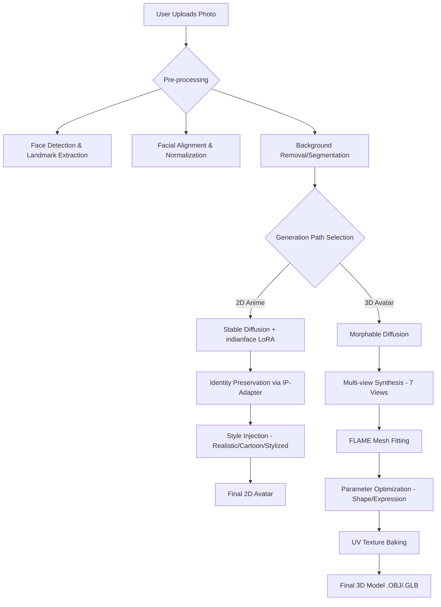

# 🇮🇳 Indian Avatar AI: 2D & 3D Stylization System

## 🌟 Introduction
The **Indian Avatar AI** is a professional-grade generative system tailored specifically for the Indian demographic. It solves the "representation gap" in global AI models by focusing on Indian facial morphology, diverse skin tones, and cultural aesthetics.

The system provides a seamless experience for:
*   **2D Anime Stylization**: Creating high-fidelity artistic avatars.
*   **3D Avatar Reconstruction**: Generating geometry-accurate 3D head models for metaverse and gaming applications.

---

## 🏗️ System Architecture & Workflow

### High-Level Graphical Workflow

---

## 🛠️ Tech Stack & Advanced Libraries

### Core Architecture
*   **Language**: Python 3.11 (Optimized for library compatibility).
*   **AI Framework**: PyTorch 2.x with CUDA 12.1.
*   **Distribution**: HuggingFace `diffusers`, `transformers`, `accelerate`.

### Specialized Modules
| Component | Technology | Purpose |
| :--- | :--- | :--- |
| **Generative AI** | Stable Diffusion (AnyLoRA) | Base image synthesis engine. |
| **Optimization** | PEFT (LoRA) | Cultural adaptation without full retraining. |
| **Computer Vision** | MediaPipe | Real-time facial mesh and iris tracking. |
| **3D Geometry** | FLAME Model | SOTA morphable face model for 3D reconstruction. |
| **UI** | Gradio 5.x | High-performance reactive web interface. |
| **Backend** | Uvicorn/FastAPI | Robust local serving and protocol handling. |

---

## 🤖 Algorithms & Training Methodology

### 1. Fine-tuning with LoRA (Low-Rank Adaptation)
Instead of training a model from scratch, we use **LoRA** to inject "Indian intelligence" into the model.
*   **Trigger Word**: `indianface`
*   **Dataset**: 25,000+ pre-processed images from the IMFDB.
*   **Focus**: Correct skin tone rendering, traditional clothing (Sari/Kurta), and jewelry (Nose pins/Jhumkas).

### 2. Mesh Fitting Pipeline
We utilize an iterative optimization loop to fit the FLAME mesh to 2D landmarks:
1.  **Landmark Projection**: Translate 2D MediaPipe points into 3D space.
2.  **Loss Function**: Minimize the distance between projected vertices and target landmarks.
3.  **Regularization**: Ensure the face remains biologically plausible using FLAME's learned priors.

---

## 📊 Dataset: IMFDB (Indian Movie Face Database)
The dataset is the foundation of our model's accuracy. We transitioned to IMFDB after discovering the IFExD dataset was unavailable for public download.

*   **Extraction**: Custom `scripts/download_imfdb.py` directly interfaces with academic CDNs.
*   **Preprocessing**: `scripts/preprocess_imfdb.py` uses MediaPipe to level faces, ensuring the AI learns from squared, normalized samples.
*   **Volume**: 34,000+ raw images -> 25,000+ clean training samples.

---

## ⚠️ Challenges & Intelligent Solutions

### 1. ❄️ The 4GB VRAM "Glass Ceiling"
**Problem**: Diffusion models typically crash on 4GB GPUs due to OOM (Out of Memory) errors.
**Solution**: 
*   **8-bit Quantization**: Using `bitsandbytes` to store optimizer states in 8-bit instead of 32-bit.
*   **Gradient Checkpointing**: Re-calculating activation during the backward pass instead of storing them.
*   **Safe-Tensors**: Using memory-mapped model weights to minimize CPU-to-GPU transfer spikes.

### 2. 🧩 Windows-Specific Failures (Xformers)
**Problem**: The common `xformers` optimization library has broken binary compatibility with some Windows Python 3.11/3.12 environments.
**Solution**: We refactored the pipeline to use **PyTorch 2.0 SDPA (Scaled Dot Product Attention)**, which provides similar performance to xformers but is natively supported on Windows.

### 3. 🌐 Dual-GPU Setup (NVIDIA + Intel)
**Problem**: Systems with integrated Intel graphics often confuse PyTorch, leading to training hanging or using the wrong (slower) device.
**Solution**: Implemented explicit environment variable control `os.environ["CUDA_VISIBLE_DEVICES"] = "0"` and device-aware loading to force utilization of the **NVIDIA 3050**.

---

## 🖥️ Hardware Requirements & Optimization
*   **Required**: NVIDIA GPU (3050 4GB or higher).
*   **Recommended**: 16GB System RAM.
*   **Optimization Layer**:
    *   `enable_sequential_cpu_offload()`: Reduces VRAM usage from 8GB to ~3.2GB.
    *   `enable_vae_tiling()`: Allows high-res generation on low memory.

---

## 🚀 Execution Workflow
1.  **Initialize**: `python scripts/setup_venv.py`
2.  **Fetch Data**: `python scripts/download_imfdb.py`
3.  **Align Faces**: `python scripts/preprocess_imfdb.py`
4.  **Train LoRA**: `python scripts/train_lora.py`
5.  **Start UI**: `python app.py`

---
Developed by "GUNI Research Intern Team"
