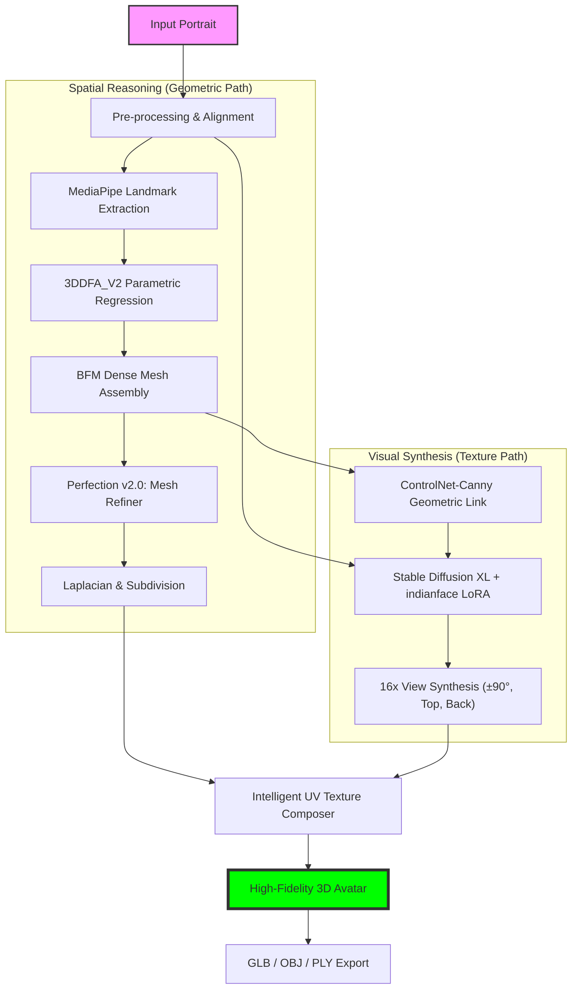
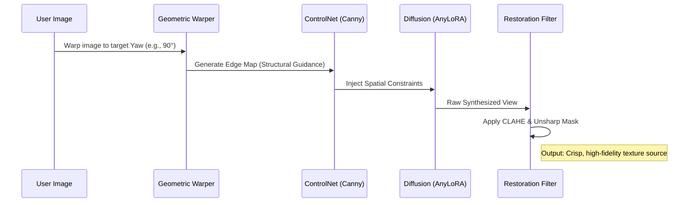

# 🇮🇳 Indian Avatar AI: Single Image to Stylized 3D (v2.0)

> **The definitive research-grade pipeline for generating high-fidelity, stylized 3D avatars from a single face photo — optimized for Indian facial morphology, cultural aesthetics, and premium geometric smoothness.**

---

## 🌟 Executive Summary

**Indian Avatar AI (Perfection v2.0)** is an end-to-end AI framework designed to bridge the "representation gap" in global facial models. While most 3D face generators are trained on Western datasets, this system utilizes specific **Cultural LoRAs (indianface)** and **Advanced Morphable Models (BFM)** to capture the unique geometric and textural nuances of the Indian demographic.

The **Perfection v2.0** update introduces a "High Improvement" tier, utilizing **ControlNet-guided Synthesis** and **Non-Linear Mesh Refinement** to produce smooth, production-ready 3D heads from unconstrained 2D inputs.

---

## 🏗️ Technical Architecture & Workflows

### 1. High-Level System Workflow
The pipeline operates as a directed acyclic graph (DAG) of specialized neural and geometric nodes:


```mermaid
graph TD
    %% Input
    INPUT[Input Portrait] --> PRE[Pre-processing & Alignment]
    
    subgraph "Spatial Reasoning (Geometric Path)"
        PRE --> DET[MediaPipe Landmark Extraction]
        DET --> RECON[3DDFA_V2 Parametric Regression]
        RECON --> BFM_GEN[BFM Dense Mesh Assembly]
        BFM_GEN --> REFINE[Perfection v2.0: Mesh Refiner]
        REFINE --> SMOOTH[Laplacian & Subdivision]
    end
    
    subgraph "Visual Synthesis (Texture Path)"
        PRE --> SD_GEN[Stable Diffusion XL + indianface LoRA]
        BFM_GEN --> CN_HINT[ControlNet-Canny Geometric Link]
        CN_HINT --> SD_GEN
        SD_GEN --> MV_GEN["16x View Synthesis (±90°, Top, Back)"]
    end
    
    %% Blending
    SMOOTH --> COMP[Intelligent UV Texture Composer]
    MV_GEN --> COMP
    
    %% Output
    COMP --> FINAL[High-Fidelity 3D Avatar]
    FINAL --> EXPORT[GLB / OBJ / PLY Export]

    style INPUT fill:#f9f,stroke:#333,stroke-width:2px
    style FINAL fill:#00ff00,stroke:#333,stroke-width:4px
```

### 2. The Perfection v2.0 Decision Logic
Our synthesis engine isn't just "guessing" the back of the head. It follows a multi-stage structural guidance sequence:


```mermaid
sequenceDiagram
    participant U as User Image
    participant G as Geometric Warper
    participant C as ControlNet (Canny)
    participant D as Diffusion (AnyLoRA)
    participant R as Restoration Filter

    U->>G: Warp image to target Yaw (e.g., 90°)
    G->>C: Generate Edge Map (Structural Guidance)
    C->>D: Inject Spatial Constraints
    D->>R: Raw Synthesized View
    R->>R: Apply CLAHE & Unsharp Mask
    Note right of R: Output: Crisp, high-fidelity texture source
```

---

## 🔬 Core Algorithms: Technical Deep Dive

### 📐 1. 3DMM Parameter Regression (3DDFA_V2)
The core geometry is driven by a 62-dimensional vector $\mathbf{p} \in \mathbb{R}^{62}$, regressed via a MobileNet-v3 backbone:
$$\mathbf{p} = [\underbrace{\phi}_{12}, \underbrace{\alpha}_{40}, \underbrace{\beta}_{10}]$$
*   **$\phi$ (Pose)**: 12-dim vector for camera rotation, translation, and scale.
*   **$\alpha$ (Shape)**: 40-dim coefficients for the Basel Face Model (BFM) principal components.
*   **$\beta$ (Expression)**: 10-dim coefficients representing facial action units.

**Dense Mesh Reconstruction**:
The vertex positions $\mathbf{S}$ are calculated as:
$$\mathbf{S} = \mathbf{\bar{S}} + \mathbf{A}_{shape}\alpha + \mathbf{A}_{exp}\beta$$
Where $\mathbf{\bar{S}}$ is the mean shape, and $\mathbf{A}$ are the bias matrices for shape and expression.

### 🌀 2. Mesh Refinement (Perfection Module)
To solve the "low-poly" look of raw 3DMMs, we apply:
*   **Loop-style Subdivision**: Iteratively splits each triangle into four, increasing vertex density by 4x per level.
*   **Laplacian Smoothing**: A differential operator applied to the mesh:
    $\Delta v_i = \sum_{j \in N(i)} w_{ij}(v_j - v_i)$
    This removes high-frequency geometric noise (stair-stepping) while preserving the global volume.

### 🎨 3. ControlNet-Canny Texture Synthesis
Standard `img2img` often loses identity at side angles. We solve this by extracting Canny edges from a **Geometric Hint** (the warped front photo).
*   **ControlNet Scale**: $0.8$ (Structural guidance).
*   **Denoising Strength**: $0.6 - 0.9$ (Increasing as we move from front to back).
*   **Sharpening**: A final **Unsharp Mask** ($1.5 \times$ radius 2.0) and **CLAHE** (Clip 2.0) are applied to remove diffusion blur.

---

## 📁 Repository Overview

```text
3d_model/
├── app.py                     # Entry point (Gradio UI with dynamic slider)
├── src/
│   ├── models/
│   │   ├── face_recon.py      # 3DDFA_V2 & BFM geometry orchestrator
│   │   ├── anime_gen.py       # Stylized 2D avatar pipeline
│   │   └── morphable_diffusion.py # Final 3D generation manager
│   ├── synthesis/
│   │   └── multi_view_generator.py  # ControlNet Guided Synthesis + Restoration
│   ├── recon/
│   │   ├── mesh_refiner.py    # NEW: Subdivision & Laplacian Smoothing (v2.0)
│   │   ├── texture_composer.py # NEW: Brightness Norm & Cubic Weighting (v2.0)
│   │   └── mesh_fit.py        # LM-based shape optimization
│   └── preprocess/
│       ├── segment.py         # Multi-layer background removal
│       └── extractor.py       # Landmark-based crop & align
├── scripts/
│   ├── setup_venv.py          # Windows environment auto-setup
│   ├── train_lora.py          # Indian Cultural LoRA Trainer
│   ├── fix_dependencies.py    # Conflict resolution for xformers/pytorch
│   └── test_gpu.py            # CUDA Diagnostic Tool
└── constraints.txt            # Package version pinning for stability
```

---

## 🛠️ Performance & Memory Optimization

The pipeline is engineered to run on **consumer-grade GPUs (4GB VRAM)** through several strategies:
1.  **Sequential CPU Offloading**: Moves model components to RAM when not in active use.
2.  **8-bit Quantization**: Uses `bitsandbytes` to reduce the Weight footprint of the UNet.
3.  **VAE Tiling**: Processes high-resolution textures in small tiles to prevent OOM errors.
4.  **ONNX Acceleration**: 3DDFA_V2 is served via ONNX Runtime for 10x faster geometry regression compared to raw PyTorch.

---

## � Installation & Quick Start

### 1. Prerequisites
*   **OS**: Windows 10/11
*   **Python**: 3.11.x (Strictly required for xformers compatibility)
*   **GPU**: NVIDIA RTX 20-series or higher (4GB+ VRAM)

### 2. Setup
```powershell
# Auto-setup virtual environment and dependencies
python scripts/setup_venv.py

# Launch the Application
python app.py
```

### 3. Workflow
1.  **Input**: Upload a high-quality, front-facing face photo.
2.  **2D Style**: Toggle between "Stylized Digital Art" or "3D Cartoon".
3.  **3D Perfection**: Click "Generate 3D Avatar" to trigger the synthesis + refinement pipeline.
4.  **Review**: Use the **Dynamic Preview Slider** to inspect the 16 synthesized side views.
5.  **Refine**: Live-tune the expression and shape sliders.
6.  **Export**: Save as `.glb` for Unity, Unreal Engine, or WebGL.

---

## 📄 References & Credits

*   **Geometry**: [3DDFA_V2](https://github.com/cleardusk/3DDFA_V2) (Towards Fast, Accurate 3D Face Alignment).
*   **Morphable Model**: BFM 2009 (A Morphable Model for the Synthesis of 3D Faces).
*   **Synthesis**: Stable Diffusion + [ControlNet](https://github.com/lllyasviel/ControlNet).
*   **Dataset**: IMFDB (Indian Movie Face Database).

---
*Developed with ❤️ by the GUNI Research Intern Team*
*Maintained by Antigravity AI — Version 2.0.1 Perfection Phase*
