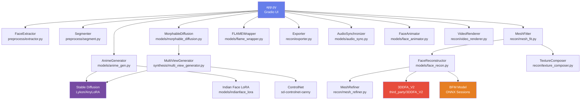

<p align="center">
  
  
  
  
  
  
</p>

<h1 align="center">🎭 Single Image to Stylized 3D/2D Avatar Generation</h1>

<p align="center">
  <strong>Indian Avatar AI — Deep Accuracy 2.0</strong><br/>
  <em>Transform a single face photograph into stunning 2D stylized art, photorealistic 3D avatar models,<br/>and speaking lip-synced videos — all from one click.</em>
</p>

<p align="center">
  <a href="#-key-features">Features</a> •
  <a href="#-system-architecture">Architecture</a> •
  <a href="#-ml-pipelines">ML Pipelines</a> •
  <a href="#-technology-stack">Tech Stack</a> •
  <a href="#-installation">Installation</a> •
  <a href="#-usage">Usage</a> •
  <a href="#-challenges--solutions">Challenges</a> •
  <a href="#-project-structure">Project Structure</a>
</p>

---

## 📋 Table of Contents

1. [Project Overview](#-project-overview)
2. [Key Features](#-key-features)
3. [System Architecture](#-system-architecture)
4. [ML Pipelines in Detail](#-ml-pipelines-in-detail)
   - [Preprocessing Pipeline](#1-preprocessing-pipeline)
   - [2D Stylized Generation Pipeline](#2-2d-stylized-generation-pipeline)
   - [3D Avatar Generation Pipeline](#3-3d-avatar-generation-pipeline)
   - [Lip-Sync Animation Pipeline](#4-lip-sync-animation-pipeline)
   - [LoRA Fine-Tuning Pipeline](#5-lora-fine-tuning-pipeline)
5. [Technology Stack](#-technology-stack)
6. [Code Workflow & Architecture](#-code-workflow--architecture)
7. [Project Structure](#-project-structure)
8. [Installation](#-installation)
9. [Usage](#-usage)
10. [Challenges & Solutions](#-challenges--solutions)
11. [Future Scope](#-future-scope)

---

## 🌟 Project Overview

**Single Image to Stylized 3D/2D Avatar Generation** (codename: *Indian Avatar AI — Deep Accuracy 2.0*) is an end-to-end deep learning system that takes a **single front-facing photograph** and generates:

| Output | Description |
|--------|-------------|
| **Stylized 2D Art** | Hand-painted digital art portraits with vibrant colors and artistic lighting |
| **Cartoon 2D Art** | Pixar/Disney-style 3D cartoon characters with big expressive eyes |
| **Photorealistic 3D Model** | High-poly BFM mesh (~38K vertices, ~76K faces) with UV-mapped texture, exportable as GLB/OBJ |
| **Multi-View Synthesis** | 16 camera angles (front, ±30°, ±45°, ±60°, ±90°, top, bottom, back) for full 360° texture |
| **Speaking Avatar Video** | Lip-synced video with realistic facial expressions, blinks, brow raises, and head micro-motion |
| **Parametric Customization** | Real-time slider-based face editing (nose, jaw, eyes, emotions) via BFM shape/expression params |

The system is specifically optimized for **Indian facial features** through a custom LoRA model fine-tuned on the **IMFDB** (Indian Movie Face Database) dataset. It runs on consumer hardware with as little as **4GB VRAM** through aggressive memory optimization strategies.

---

## 🎯 Key Features

### 🖼️ 2D Generation
- **Stylized Image Generation** — Vibrant digital art portraits using Stable Diffusion img2img with Indian-face-optimized prompts
- **Cartoon Image Generation** — Pixar/Disney-style characters with higher denoising strength for maximum stylistic transformation
- **LoRA-Enhanced Identity** — Custom Low-Rank Adaptation (LoRA) weights fine-tuned on 10,000+ Indian face images for authentic ethnic feature preservation

### 🧊 3D Avatar Generation
- **3DDFA_V2 + BFM Morphable Model** — Dense 3D face reconstruction producing 38,365 vertices and 76,073 faces from a single photograph
- **16-View Multi-Angle Synthesis** — Stable Diffusion ControlNet generates consistent side/back/top views that are blended into a seamless UV texture map
- **Multi-View Texture Composition** — Angle-weighted blending with per-vertex normal-based confidence scoring for artifact-free 360° texturing
- **Mesh Refinement** — Laplacian smoothing + Loop-style subdivision for premium, high-resolution mesh quality
- **Dual Export Formats** — Downloadable as both OBJ (with MTL material) and GLB (self-contained binary)

### 🗣️ Speaking Avatar (Lip Sync)
- **Text-to-Speech** — Microsoft Edge TTS with 6 voice options (including Indian English voices)
- **Audio Envelope Extraction** — Librosa-based RMS energy analysis with temporal smoothing for natural mouth movement curves
- **Full Facial Animation** — Lip sync, periodic eye blinks, eye squints, brow raises, jaw drop, cheek pull, and head micro-motion
- **2D Face Warping** — MediaPipe Face Mesh (468 landmarks) → smooth displacement fields → `cv2.remap` for artifact-free animation
- **Video Assembly** — MoviePy-powered MP4 generation with synchronized audio

### ⚙️ Fine-Tuned Customization
- **Parametric Shape Editing** — Real-time nose bridge, jawline, and forehead/eye depth sliders mapped to BFM shape parameters
- **Expression Presets** — Happy, Sad, Angry, Surprised emotion presets mapped to BFM expression coefficients
- **Interactive 3D Viewer** — Gradio Model3D component for real-time rotation and inspection

---

## 🏗️ System Architecture

```
┌─────────────────────────────────────────────────────────────────────────┐
│                              GRADIO UI (app.py)                        │
│  ┌─────────────┐  ┌────────────────┐  ┌──────────────────────────────┐ │
│  │ Step 1:     │  │ Step 2:        │  │ Step 3:                      │ │
│  │ Upload      │→ │ Mode Selection │→ │ 2D Generation │ 3D Generation│ │
│  │ Photo       │  │ (2D / 3D)      │  │              │ + Lip Sync   │ │
│  └─────────────┘  └────────────────┘  └──────────────────────────────┘ │
└───────────────────────────────┬─────────────────────────────────────────┘
                                │
            ┌───────────────────┼───────────────────┐
            ▼                   ▼                   ▼
┌──────────────────┐ ┌──────────────────┐ ┌──────────────────────────┐
│  PREPROCESSING   │ │  2D PIPELINE     │ │  3D PIPELINE             │
│                  │ │                  │ │                          │
│ FaceExtractor    │ │ AnimeGenerator   │ │ MorphableDiffusion       │
│ (MediaPipe Face  │ │ (SD img2img +    │ │ └→ MultiViewGenerator    │
│  Mesh Alignment) │ │  LoRA + DPM++)   │ │    (16 views via SD      │
│                  │ │                  │ │     ControlNet + Canny)   │
│ Segmenter        │ │ Style Prompts:   │ │                          │
│ (BG Removal)     │ │ • Stylized       │ │ MeshFitter               │
│                  │ │ • Cartoon        │ │ └→ FaceReconstructor      │
└──────────────────┘ └──────────────────┘ │    (3DDFA_V2 + BFM ONNX) │
                                          │ └→ TextureComposer        │
                                          │    (Multi-view UV blend)  │
                                          │ └→ MeshRefiner            │
                                          │    (Laplacian + Subdivide)│
                                          │ └→ Exporter (OBJ / GLB)  │
                                          └──────────────────────────┘
                                                      │
                                          ┌───────────┴───────────┐
                                          ▼                       ▼
                                ┌──────────────────┐  ┌────────────────┐
                                │ CUSTOMIZATION    │  │ LIP SYNC       │
                                │                  │  │                │
                                │ FLAMEWrapper     │  │ AudioSync      │
                                │ (Shape/Expr      │  │ (Edge TTS +    │
                                │  params → BFM    │  │  Librosa RMS)  │
                                │  re-generation)  │  │                │
                                │                  │  │ FaceAnimator   │
                                │ Sliders:         │  │ (468 landmarks │
                                │ • Nose Bridge    │  │  displacement  │
                                │ • Jaw Width      │  │  field warping)│
                                │ • Eye Depth      │  │                │
                                │ • Emotions       │  │ VideoRenderer  │
                                └──────────────────┘  │ (MoviePy MP4)  │
                                                      └────────────────┘
```

### Data Flow Summary

```
Input Photo ─→ MediaPipe Alignment (512×512) ─┬─→ SD img2img → 2D Art
                                                │
                                                ├─→ 16-View Synthesis ─→ BFM Mesh Reconstruction
                                                │       │                       │
                                                │       └→ Texture Composition ─┘→ Refinement → GLB/OBJ
                                                │
                                                └─→ TTS Audio → Envelope → Face Warping → MP4 Video
```

---

## 🔬 ML Pipelines in Detail

### 1. Preprocessing Pipeline

**Module:** `src/preprocess/extractor.py` → `FaceExtractor`

| Step | Operation | Technology |
|------|-----------|------------|
| 1 | Face Detection | MediaPipe Face Detection (`model_selection=1`) |
| 2 | 468-Point Landmark Detection | MediaPipe Face Mesh (`refine_landmarks=True`) |
| 3 | Eye-Based Rotation Alignment | OpenCV `getRotationMatrix2D` + `warpAffine` |
| 4 | Bounding Box Crop with 1.5× Padding | NumPy min/max across all landmarks |
| 5 | Resize to 512×512 | `cv2.INTER_LANCZOS4` for high-quality downsampling |

**How It Works:**
The preprocessor uses MediaPipe's Face Mesh to detect 468 facial landmarks. It calculates the rotation angle between the left (landmark #33) and right (landmark #263) eye centers, applies an affine rotation to level the face, then re-detects landmarks on the rotated image for an accurate crop. The crop uses the convex hull of all landmarks with 1.5× padding to ensure the full head is captured — including forehead and chin — which is critical for 3D reconstruction accuracy.

**Module:** `src/preprocess/segment.py` → `Segmenter`

Background removal module (placeholder for MODNet/U²-Net integration). Currently passes through the original image to maintain pipeline compatibility.

---

### 2. 2D Stylized Generation Pipeline

**Module:** `src/models/anime_gen.py` → `AnimeGenerator`

```
Aligned Face (512×512)
       │
       ▼
┌──────────────────────────────┐
│ Stable Diffusion img2img    │
│ Model: Lykon/AnyLoRA        │
│ Scheduler: DPM++ Multistep  │
│ LoRA: indianface_lora (PEFT)│
│                              │
│ Stylized:                    │
│   strength=0.65, steps=12   │
│   "stylized digital art     │
│    portrait, indianface..."  │
│                              │
│ Cartoon:                     │
│   strength=0.75, steps=12   │
│   "pixar 3d cartoon         │
│    character, indianface..." │
└──────────────────────────────┘
       │
       ▼
  Stylized/Cartoon Output (512×512)
```

**Key Technical Details:**
- **Base Model:** [Lykon/AnyLoRA](https://huggingface.co/Lykon/AnyLoRA) — A Stable Diffusion 1.5 checkpoint specifically designed for LoRA compatibility and diverse art styles
- **Scheduler:** DPM++ Multistep Solver — Achieves high-quality results in only 12 inference steps (vs. 50+ with default DDPM)
- **LoRA Fine-Tuning:** Custom Indian Face LoRA (LoRA-rank=4, α=8) trained on IMFDB dataset, loaded via PEFT library
- **VRAM Strategy for 4GB GPU:**
  - `enable_model_cpu_offload()` — Moves entire model components to CPU when not in use (faster than sequential layer offloading)
  - `enable_attention_slicing("max")` — Splits attention computation into chunks to fit in limited VRAM
  - `enable_vae_tiling()` — Processes VAE decode/encode in tiles instead of full-image
- **OOM Fallback:** If CUDA OOM occurs mid-generation, the system retries with a smaller 384×384 input, fewer steps (8), and lower strength (0.6), then upscales back to 512×512

**Style-Specific Prompting:**
| Style | Strength | Prompt Strategy | Negative Prompt |
|-------|----------|-----------------|-----------------|
| Stylized | 0.65 | Digital art, brushstrokes, dramatic lighting | Photo, realistic, 3D render |
| Cartoon | 0.75 | Pixar, Disney, big eyes, smooth 3D render | Realistic, photo, painting, sketch |

Both prompts include `(indian heritage:1.2)` weighted token and the trigger word `indianface` for LoRA activation.

---

### 3. 3D Avatar Generation Pipeline

The 3D pipeline is the most complex component, spanning 5 modules across 3 stages:

#### Stage 1: Multi-View Synthesis (16 Views)

**Module:** `src/synthesis/multi_view_generator.py` → `MultiViewGenerator`
**Orchestrator:** `src/models/morphable_diffusion.py` → `MorphableDiffusion`

```
Single Front Photo
       │
       ▼
┌─────────────────────────────────────────────────────┐
│        16-VIEW SYNTHESIS ENGINE                      │
│                                                      │
│  For each of 16 camera angles:                       │
│  ┌─────────────────────────────────────────────┐    │
│  │ 1. Geometric Pre-Rotation (30% intensity)   │    │
│  │    → Gives diffusion model a "hint"          │    │
│  │                                               │    │
│  │ 2. Canny Edge Detection (ControlNet cond.)   │    │
│  │    → GaussianBlur(3,3) → Canny(100,200)      │    │
│  │                                               │    │
│  │ 3. SD ControlNet img2img Generation          │    │
│  │    Model: Lykon/AnyLoRA + sd-controlnet-canny│    │
│  │    Prompt: "same person, same identity..."   │    │
│  │    Steps: 20, Guidance: 7.5                  │    │
│  │    Strength: 0.30 (front) → 0.80 (back)     │    │
│  │                                               │    │
│  │ 4. CLAHE + Unsharp Mask Sharpening           │    │
│  │    → Crisp, high-fidelity output             │    │
│  └─────────────────────────────────────────────┘    │
│                                                      │
│  CPU Fallback: Geometric Affine/Perspective Warps   │
│  → Perspective transforms + angle lighting sim      │
│  → Mirrored + blurred + hair-tinted back views      │
└─────────────────────────────────────────────────────┘
```

**View Specifications (16 Cameras):**

| # | View Name | Yaw | Pitch | Denoising Strength | Strategy |
|---|-----------|-----|-------|--------------------|----------|
| 1 | Front | 0° | 0° | 0.30 | Preserve identity strongly |
| 2 | Left 30° | -30° | 0° | 0.45 | Gentle side turn |
| 3 | Right 30° | +30° | 0° | 0.45 | Gentle side turn |
| 4 | Left 45° | -45° | 0° | 0.55 | Semi-profile |
| 5 | Right 45° | +45° | 0° | 0.55 | Semi-profile |
| 6 | Left 60° | -60° | 0° | 0.60 | Side profile |
| 7 | Right 60° | +60° | 0° | 0.60 | Side profile |
| 8 | Left 90° | -90° | 0° | 0.65 | Full side (ear visible) |
| 9 | Right 90° | +90° | 0° | 0.65 | Full side (ear visible) |
| 10 | Top-Left | -45° | +30° | 0.60 | Elevated view |
| 11 | Top-Right | +45° | +30° | 0.60 | Elevated view |
| 12 | Top | 0° | +60° | 0.70 | Crown view |
| 13 | Bottom | 0° | -45° | 0.65 | Chin/jaw visible |
| 14 | Back-Left | -135° | 0° | 0.75 | Back-of-head |
| 15 | Back-Right | +135° | 0° | 0.75 | Back-of-head |
| 16 | Back | 180° | 0° | 0.80 | Complete back (hair/nape) |

**Denoising Strength Strategy:** Views closer to the front use lower strength (0.30) to maximally preserve the input identity. Back views use high strength (0.80) because they have no direct pixel correspondence with the front photo, allowing the model more creative freedom to generate realistic hair and neck textures.

#### Stage 2: 3D Mesh Reconstruction

**Module:** `src/models/face_recon.py` → `FaceReconstructor`
**Module:** `src/recon/mesh_fit.py` → `MeshFitter`

```
Front View Image
       │
       ▼
┌──────────────────────────────────────┐
│    3DDFA_V2 + BFM RECONSTRUCTION     │
│                                       │
│  1. Face Detection                    │
│     → cv2 Haar Cascade fallback       │
│                                       │
│  2. ONNX MobileNet Regression         │
│     → Input: 120×120 cropped face    │
│     → Output: 62-dim parameter vector │
│     → [12 pose | 40 shape | 10 expr] │
│                                       │
│  3. Dense BFM Mesh Reconstruction     │
│     → ONNX BFM session               │
│     → Input: R, offset, α_shp, α_exp │
│     → Output: (3, 38365) vertices     │
│                                       │
│  4. UV Texture Baking                 │
│     → BFM_UV.mat UV coordinates       │
│     → Per-vertex color sampling       │
│     → 1024×1024 texture map           │
│     → 8× iterative dilation hole fill │
│     → Gaussian blur for smoothness    │
│                                       │
│  5. Trimesh Assembly                  │
│     → Y-axis flip for 3D viewer       │
│     → Centroid centering + scaling    │
│     → PBR Material (metallic=0,       │
│       roughness=0.7)                  │
└──────────────────────────────────────┘
```

**BFM (Basel Face Model) Parameter Breakdown:**
| Range | Parameters | Count | Semantic Meaning |
|-------|------------|-------|-----------------|
| 0–11 | Pose | 12 | Rotation matrix (R) + Translation offset |
| 12–51 | Shape | 40 | PCA coefficients: face scale, width, jaw, nose, forehead |
| 52–61 | Expression | 10 | Brow raise, smile, mouth open, eye squint, etc. |

#### Stage 2.5: Multi-View Texture Composition

**Module:** `src/recon/texture_composer.py` → `TextureComposer`

```
16 Synthesized Views + BFM Mesh + UV Coords
                    │
                    ▼
┌──────────────────────────────────────────────┐
│     MULTI-VIEW TEXTURE COMPOSITION            │
│                                                │
│  For each of 16 views:                         │
│  1. Compute per-vertex normals (cross product) │
│  2. Compute view direction from yaw/pitch      │
│  3. Confidence = dot(normal, view_direction)    │
│     → Only vertices facing the camera used     │
│                                                │
│  4. Rotate vertices by camera angle (Ry × Rx)  │
│  5. Sample pixel colors at rotated 2D coords   │
│  6. Accumulate: color += rgb × confidence³     │
│     (power 3.0 for smooth localized blending)  │
│                                                │
│  7. Normalize by total weight per UV texel     │
│  8. Fill holes: 12× iterative 5×5 dilation     │
│  9. Final Gaussian blur (3×3, σ=0.5)           │
│  10. Brightness normalization (CLAHE matching)  │
└──────────────────────────────────────────────┘
                    │
                    ▼
        1024×1024 Seamless UV Texture Map
```

#### Stage 3: Mesh Refinement & Export

**Module:** `src/recon/mesh_refiner.py` → `MeshRefiner`
**Module:** `src/recon/exporter.py` → `Exporter`

```
Raw BFM Mesh (38K verts, 76K faces)
       │
       ▼
┌──────────────────────────────────┐
│    MESH REFINEMENT               │
│                                   │
│  1. Laplacian Smoothing           │
│     → 10 iterations, λ=0.5       │
│     → Removes stair-stepping     │
│       artifacts from regression  │
│                                   │
│  2. Loop-Style Subdivision        │
│     → 1 level: splits each face  │
│       into 4 sub-faces           │
│     → 2 additional Laplacian     │
│       passes after each subdivide│
│     → Result: ~153K verts,       │
│       ~304K faces                │
│                                   │
│  3. Normal Fixing                 │
│     → Consistent outward normals │
└──────────────────────────────────┘
       │
       ▼
┌──────────────────────────────────┐
│    EXPORT                         │
│                                   │
│  • OBJ + MTL (Wavefront)         │
│    → Universal compatibility     │
│    → Separate material file      │
│                                   │
│  • GLB (Binary glTF 2.0)         │
│    → Self-contained (mesh +      │
│      texture in one file)        │
│    → Web/AR/VR-ready             │
└──────────────────────────────────┘
```

---

### 4. Lip-Sync Animation Pipeline

**Modules:**
- `src/models/audio_sync.py` → `AudioSynchronizer`
- `src/models/face_animator.py` → `FaceAnimator`
- `src/recon/video_renderer.py` → `VideoRenderer`

```
User Types Text  ─→  Edge TTS (Microsoft Neural Voices)  ─→  WAV audio
                                                                │
                                                                ▼
                                                    Librosa RMS Envelope
                                                    (30 fps, smoothed)
                                                                │
                                 ┌──────────────────────────────┤
                                 │                              │
                                 ▼                              ▼
                     MediaPipe Face Mesh              Audio Envelope Array
                     (468 landmarks on                [0.0, 0.3, 0.8, ...]
                      source photo)                         │
                                 │                          │
                                 ▼                          │
                     ┌──────────────────────┐               │
                     │  Per-Frame Animation │ ◄─────────────┘
                     │                      │
                     │  7 Expression Layers │
                     │  combined into one   │
                     │  displacement field: │
                     │                      │
                     │  1. Mouth (lip sync) │
                     │  2. Jaw drop         │
                     │  3. Cheek pull       │
                     │  4. Eye blink        │
                     │  5. Eye squint       │
                     │  6. Brow raise       │
                     │  7. Head micro-motion│
                     │                      │
                     │  → Gaussian blur     │
                     │  → cv2.remap()       │
                     └──────────────────────┘
                                 │
                                 ▼
                     List[numpy RGB frames]
                                 │
                                 ▼
                     MoviePy ImageSequenceClip
                     + AudioFileClip
                     → MP4 (H.264 + AAC)
```

**Face Animation Technical Details:**

| Expression | Trigger Condition | Displacement Strategy |
|-----------|-------------------|----------------------|
| **Mouth Open** | `mouth_open > 0.03` | Upper lip slight rise, lower lip + chin push down; horizontal pull for mouth corner tightening |
| **Jaw Drop** | `mouth_open > 0.1` | Entire lower face shifts downward with quadratic falloff from lower lip to chin |
| **Cheek Pull** | `mouth_open > 0.5` | Left/right cheeks pull inward using cosine-weighted radial displacement |
| **Eye Blink** | Scheduled every 2.5–5.5s | 4–6 frame sine-curve blink; upper eyelid pushes down (70%), lower eyelid pushes up (30%) |
| **Eye Squint** | `mouth_open > 0.8` | Gentle lid squeeze proportional to speech volume |
| **Brow Raise** | `mouth_open > 0.6` | Upward displacement of brow landmarks, emphasis on emphatic speech |
| **Head Motion** | Always active | Slow sinusoidal nod (2.5 Hz) + sway (1.3 Hz) with pivot at chin |

**Audio Envelope Processing:**
1. Load WAV with librosa (native sample rate)
2. Compute RMS energy per audio frame (`frame_length = sr / 30`)
3. Moving average smoothing (window=5)
4. Normalize to [0, 1]
5. Non-linear power mapping (`x^1.3`) — quiet sounds barely open mouth, loud sounds open wide
6. Exponential temporal smoothing (`α=0.3`) — prevents frame-to-frame jitter
7. Scale to `max_mouth_open=2.5`

**Available Voices:**

| Voice | ID | Accent |
|-------|-----|--------|
| Male (Christopher) | `en-US-ChristopherNeural` | American |
| Female (Jenny) | `en-US-JennyNeural` | American |
| Male (Guy) | `en-US-GuyNeural` | American |
| Female (Aria) | `en-US-AriaNeural` | American |
| Male Indian (Prabhat) | `en-IN-PrabhatNeural` | Indian English |
| Female Indian (Neerja) | `en-IN-NeerjaNeural` | Indian English |

---

### 5. LoRA Fine-Tuning Pipeline

**Module:** `scripts/train_lora.py`

The system includes a complete LoRA (Low-Rank Adaptation) training pipeline for fine-tuning Stable Diffusion on Indian face data:

```
IMFDB Dataset (10,000+ Indian Face Images)
           │
           ▼
┌──────────────────────────────────────┐
│     DATA PIPELINE                     │
│                                       │
│  1. download_imfdb.py                 │
│     → Downloads dataset from IIIT-H   │
│     → CDN: cdn.iiit.ac.in            │
│                                       │
│  2. preprocess_imfdb.py               │
│     → FaceExtractor alignment         │
│     → Per-actor folder processing     │
│     → 512×512 aligned face crops     │
│                                       │
│  3. prepare_lora_metadata.py          │
│     → metadata.jsonl generation       │
│     → "indianface, [actor_name],      │
│        portrait photograph" captions  │
└──────────────────────────────────────┘
           │
           ▼
┌──────────────────────────────────────┐
│     TRAINING CONFIGURATION            │
│                                       │
│  Base Model: Lykon/AnyLoRA            │
│  LoRA Rank (r): 4                     │
│  LoRA Alpha (α): 8                    │
│  Target Modules:                      │
│    • to_k, to_q, to_v, to_out.0      │
│    • ff.net.0.proj, ff.net.2          │
│  Dropout: 0.0                         │
│  Batch Size: 1                        │
│  Gradient Accumulation: 4×            │
│  Learning Rate: 5e-5                  │
│  Max Steps: 2,500                     │
│  Mixed Precision: FP16                │
│  Optimizer: 8-bit AdamW (bitsandbytes)│
│  Gradient Checkpointing: Enabled      │
│                                       │
│  Training Loop:                       │
│    1. Encode image → VAE latents      │
│    2. Add noise at random timestep    │
│    3. Predict noise with UNet         │
│    4. MSE loss between pred & actual  │
│    5. Clip gradients (max_norm=1.0)   │
│    6. Checkpoint every 100 steps      │
│                                       │
│  Resume Training: Auto-detects        │
│    existing checkpoints               │
└──────────────────────────────────────┘
```

---

## 💻 Technology Stack

### Core ML / AI Frameworks

| Technology | Version | Purpose |
|-----------|---------|---------|
| **PyTorch** | 2.0+ | Deep learning backbone; GPU tensor computation |
| **Stable Diffusion** | v1.5 (via Diffusers) | Image generation (img2img, ControlNet) |
| **Diffusers** (HuggingFace) | Latest | Pipeline management for SD models |
| **ControlNet** | sd-controlnet-canny | Edge-guided view synthesis for multi-angle consistency |
| **PEFT** | Latest | Parameter-Efficient Fine-Tuning (LoRA) for Indian face adaptation |
| **Transformers** (HuggingFace) | Latest | CLIP text encoder for prompt conditioning |
| **Accelerate** | Latest | Multi-GPU / mixed-precision training |

### 3D Reconstruction & Geometry

| Technology | Purpose |
|-----------|---------|
| **3DDFA_V2** | 3D Dense Face Alignment — ONNX MobileNet for 62-param regression |
| **BFM (Basel Face Model)** | Morphable 3D face model with 40 shape + 10 expression PCA components |
| **ONNX Runtime** | GPU-accelerated inference for face reconstruction and BFM generation |
| **Trimesh** | 3D mesh processing, UV mapping, material handling, GLB/OBJ export |
| **FLAME Model** | Parametric head model wrapper for semantic shape/expression control |

### Computer Vision & Image Processing

| Technology | Purpose |
|-----------|---------|
| **OpenCV** | Perspective transforms, Canny edges, CLAHE, Gaussian blur, morphological ops |
| **MediaPipe** | Face detection (blazeface), Face Mesh (468 landmarks), real-time face tracking |
| **Pillow (PIL)** | Image format conversion, resizing, brightness enhancement |
| **NumPy** | Vectorized math for displacement fields, vertex operations, texture composition |
| **SciPy** | `.mat` file loading (BFM UV coordinates) |

### Audio & Video

| Technology | Purpose |
|-----------|---------|
| **Edge-TTS** | Microsoft neural text-to-speech (free, no API key required) |
| **Librosa** | Audio analysis — RMS energy extraction, sample rate handling |
| **MoviePy** | Video assembly — `ImageSequenceClip` + `AudioFileClip` → H.264 MP4 |

### Frontend & Deployment

| Technology | Purpose |
|-----------|---------|
| **Gradio** | Full-featured browser UI with Model3D viewer, sliders, galleries, video player |
| **FastAPI / Uvicorn** | Backend server (Gradio's internal server) |

### Training & Data

| Technology | Purpose |
|-----------|---------|
| **IMFDB Dataset** | Indian Movie Face Database from IIIT Hyderabad — 10K+ diverse Indian faces |
| **bitsandbytes** | 8-bit AdamW optimizer for 4GB VRAM training |
| **tqdm** | Training progress visualization |

---

## 🔄 Code Workflow & Architecture

### Module Dependency Graph


```mermaid
graph TD
    APP[app.py<br/>Gradio UI] --> FE[FaceExtractor<br/>preprocess/extractor.py]
    APP --> SEG[Segmenter<br/>preprocess/segment.py]
    APP --> AG[AnimeGenerator<br/>models/anime_gen.py]
    APP --> MD[MorphableDiffusion<br/>models/morphable_diffusion.py]
    APP --> MF[MeshFitter<br/>recon/mesh_fit.py]
    APP --> FW[FLAMEWrapper<br/>models/flame_wrapper.py]
    APP --> EX[Exporter<br/>recon/exporter.py]
    APP --> AS[AudioSynchronizer<br/>models/audio_sync.py]
    APP --> FA[FaceAnimator<br/>models/face_animator.py]
    APP --> VR[VideoRenderer<br/>recon/video_renderer.py]

    MD --> MVG[MultiViewGenerator<br/>synthesis/multi_view_generator.py]
    MF --> FR[FaceReconstructor<br/>models/face_recon.py]
    MF --> TC[TextureComposer<br/>recon/texture_composer.py]
    FR --> MR[MeshRefiner<br/>recon/mesh_refiner.py]
    FR --> TDDFA[3DDFA_V2<br/>third_party/3DDFA_V2]
    FR --> BFM[BFM Model<br/>ONNX Sessions]

    AG --> SD[Stable Diffusion<br/>Lykon/AnyLoRA]
    AG --> LORA[Indian Face LoRA<br/>models/indianface_lora]
    MVG --> CN[ControlNet<br/>sd-controlnet-canny]
    MVG --> SD

    style APP fill:#667eea,color:#fff
    style SD fill:#764ba2,color:#fff
    style TDDFA fill:#e74c3c,color:#fff
    style BFM fill:#e67e22,color:#fff
```

### Initialization Sequence

When `app.py` starts, the following modules are initialized (lazy loading for heavy models):

```python
# Immediately initialized (lightweight)
extractor    = FaceExtractor()       # MediaPipe Face Detection + Mesh
segmenter    = Segmenter()           # Placeholder
flame        = FLAMEWrapper()        # FLAME parameter wrapper
fitter       = MeshFitter()          # → Loads FaceReconstructor → 3DDFA_V2 + BFM ONNX
exporter     = Exporter()            # Filesystem writer
audio_sync   = AudioSynchronizer()   # edge-tts wrapper
face_animator = FaceAnimator()       # MediaPipe Face Mesh
video_renderer = VideoRenderer()     # MoviePy wrapper

# Lazy-loaded on first use (heavy GPU models)
anime_gen    = AnimeGenerator()      # → SD pipeline loaded on first generate()
mv_synthesis = MorphableDiffusion()  # → ControlNet loaded on first generate_views()
```

### Request Flow: 3D Avatar Generation

```
User clicks "Generate 3D Avatar"
│
├─ 1. preprocess_face()
│     → FaceExtractor.align_and_crop("temp_input.jpg")
│     → Returns aligned 512×512 PIL Image
│
├─ 2. mv_synthesis.generate_views(aligned)
│     → MultiViewGenerator._load_pipeline()     [first time only]
│     → For each of 16 ViewSpecs:
│         → _apply_geometric_hint()              [mild perspective warp]
│         → _get_canny_edges()                   [ControlNet conditioning]
│         → SD ControlNet img2img inference       [20 steps]
│         → _apply_crisp_filter()                [CLAHE + unsharp mask]
│     → Returns 16 PIL images + angle metadata
│
├─ 3. fitter.fit(views, flame, views_with_angles)
│     → FaceReconstructor.reconstruct(front_view)
│         → _detect_face()                       [Haar cascade]
│         → _predict_params()                    [ONNX MobileNet → 62 params]
│         → _reconstruct_vertices()              [Dense BFM ONNX]
│         → _bake_texture()                      [UV sampling + dilation]
│         → _build_trimesh()                     [Y-flip, center, scale]
│         → MeshRefiner.refine()                 [Laplacian + subdivide]
│     → TextureComposer.compose_texture()
│         → Compute vertex normals
│         → For each view: confidence weighting + UV accumulation
│         → Fill holes + smooth
│     → Returns refined trimesh.Trimesh
│
├─ 4. exporter.export_3d(mesh)
│     → mesh.export("assets/avatar.obj")
│     → mesh.export("assets/avatar.glb", file_type="glb")
│
└─ 5. Return to Gradio UI
      → Gallery of 16 synthesized views with angle labels
      → Front face preview
      → Interactive 3D Model viewer (GLB)
      → Download links for GLB and OBJ files
      → Pipeline statistics (time, vertices, faces, texture type)
```

---

## 📁 Project Structure

```
3d_model/
│
├── app.py                           # 🎯 Main application — Gradio UI + orchestration (792 lines)
├── requirements.txt                 # Python dependencies (30+ packages)
├── constraints.txt                  # Pip constraints for version pinning
├── .gitignore                       # Ignoring models, data, assets, temp files
│
├── src/                             # 🧠 Core source code
│   ├── __init__.py
│   │
│   ├── preprocess/                  # Image preprocessing
│   │   ├── extractor.py             #   FaceExtractor — MediaPipe alignment (98 lines)
│   │   └── segment.py               #   Segmenter — Background removal placeholder (27 lines)
│   │
│   ├── models/                      # ML model wrappers
│   │   ├── anime_gen.py             #   AnimeGenerator — SD img2img + LoRA (157 lines)
│   │   ├── morphable_diffusion.py   #   MorphableDiffusion — Multi-view orchestrator (113 lines)
│   │   ├── face_recon.py            #   FaceReconstructor — 3DDFA_V2 + BFM (388 lines)
│   │   ├── flame_wrapper.py         #   FLAMEWrapper — Parametric face params (102 lines)
│   │   ├── audio_sync.py            #   AudioSynchronizer — Edge TTS + Librosa (72 lines)
│   │   └── face_animator.py         #   FaceAnimator — 2D face warping engine (475 lines)
│   │
│   ├── synthesis/                   # View synthesis
│   │   ├── __init__.py
│   │   └── multi_view_generator.py  #   MultiViewGenerator — 16-view SD ControlNet (440 lines)
│   │
│   └── recon/                       # 3D reconstruction & export
│       ├── __init__.py
│       ├── mesh_fit.py              #   MeshFitter — BFM fitting + multi-view texture (163 lines)
│       ├── mesh_refiner.py          #   MeshRefiner — Laplacian smoothing + subdivision (55 lines)
│       ├── texture_composer.py      #   TextureComposer — Multi-view UV blending (275 lines)
│       ├── exporter.py              #   Exporter — OBJ/GLB file writer (30 lines)
│       └── video_renderer.py        #   VideoRenderer — MP4 assembly with MoviePy (163 lines)
│
├── scripts/                         # 🔧 Utility & training scripts
│   ├── download_imfdb.py            #   Download IMFDB dataset from IIIT-H CDN
│   ├── preprocess_imfdb.py          #   Batch face alignment for training data
│   ├── prepare_lora_metadata.py     #   Generate metadata.jsonl for LoRA training
│   ├── train_lora.py                #   🏋️ Full LoRA fine-tuning pipeline (210 lines)
│   ├── verify_final_lora.py         #   Validate trained LoRA weights
│   ├── inspect_unet.py              #   Debug UNet architecture for LoRA target modules
│   ├── fix_dependencies.py          #   Resolve Python dependency conflicts
│   ├── setup_data.py                #   Data directory initialization
│   ├── setup_venv.py                #   Virtual environment setup automation
│   ├── test_gpu.py                  #   CUDA/GPU verification
│   ├── test_lip_sync.py             #   Lip sync pipeline testing
│   └── test_render_lighting.py      #   3D rendering and lighting tests
│
├── models/                          # 🤖 Pre-trained model weights
│   └── indianface_lora/             #   Custom LoRA weights (PEFT format)
│       ├── adapter_model.bin        #   LoRA weight deltas
│       └── adapter_config.json      #   LoRA configuration
│
├── third_party/                     # 📦 Third-party dependencies
│   └── 3DDFA_V2/                    #   3D Dense Face Alignment V2
│       ├── configs/                 #   Model configs + BFM UV coordinates
│       ├── bfm/                     #   Basel Face Model (ONNX + pickle)
│       └── utils/                   #   3DDFA utility functions
│
├── data/                            # 📊 Training data
│   ├── raw/                         #   Raw IMFDB downloads
│   └── processed/                   #   Aligned 512×512 face crops
│
├── assets/                          # 📤 Generated outputs
│   ├── avatar.glb                   #   3D model (binary glTF)
│   ├── avatar.obj                   #   3D model (Wavefront OBJ)
│   ├── material.mtl                 #   OBJ material definition
│   ├── material_0.png               #   UV texture map
│   ├── stylized_output.png          #   2D stylized generation result
│   ├── cartoon_output.png           #   2D cartoon generation result
│   ├── speaking_avatar.mp4          #   Lip-synced speaking video
│   ├── speech.wav                   #   Generated TTS audio
│   └── exports/                     #   Additional export formats
│
├── tests/                           # 🧪 Test suite (empty — tests in scripts/)
└── venv/                            # Python virtual environment
```

---

## 🚀 Installation

### Prerequisites

- **Python** 3.10 or higher
- **NVIDIA GPU** with CUDA 11.8+ (4GB+ VRAM — optimized for consumer GPUs)
- **Git** for cloning and submodule management

### Step-by-Step Setup

```bash
# 1. Clone the repository
git clone https://github.com/Dhruvil1308/Single-Image-to-Stylized-3D.git
cd Single-Image-to-Stylized-3D

# 2. Create virtual environment
python -m venv venv

# On Windows:
venv\Scripts\activate

# On Linux/Mac:
source venv/bin/activate

# 3. Install PyTorch with CUDA support
pip install torch torchvision torchaudio --index-url https://download.pytorch.org/whl/cu118

# 4. Install all dependencies
pip install -r requirements.txt

# 5. Setup 3DDFA_V2 (third-party 3D face alignment)
cd third_party
git clone https://github.com/cleardusk/3DDFA_V2.git
cd 3DDFA_V2
# Download pre-trained models (BFM + MobileNet weights)
# Follow 3DDFA_V2's README for model download
cd ../..

# 6. (Optional) Download IMFDB dataset for LoRA training
python scripts/download_imfdb.py
python scripts/preprocess_imfdb.py
python scripts/prepare_lora_metadata.py

# 7. (Optional) Train LoRA on Indian face data
python scripts/train_lora.py

# 8. Verify GPU setup
python scripts/test_gpu.py
```

### Running the Application

```bash
python app.py
```

The Gradio interface will launch at `http://localhost:7861`.

---

## 🎮 Usage

### 2D Image Generation

1. **Upload** a clear, front-facing photograph
2. **Choose** "2D Image Generation" mode
3. **Select** a style tab:
   - **Stylized Image** — Digital art with hand-painted aesthetics
   - **Cartoon Image** — Pixar/Disney character style
4. **Click** "Generate" and wait ~10-20 seconds

### 3D Avatar Generation

1. **Upload** a front-facing photograph
2. **Choose** "3D Avatar Generation" mode
3. **Click** "Generate 3D Avatar (15+ Views)"
4. **Wait** 2-5 minutes for the full pipeline:
   - Multi-view synthesis (16 views)
   - BFM mesh reconstruction
   - Multi-view texture composition
   - Mesh refinement
5. **Explore** the result:
   - Rotate the 3D model in the interactive viewer
   - Browse synthesized views with the slider
   - Download GLB or OBJ files
6. **Customize** with sliders (nose, jaw, eyes, emotions)

### Speaking Avatar

1. **Generate** a 3D avatar first (provides the source face)
2. **Type** any text in the speech input field
3. **Select** a voice (6 options including Indian accents)
4. **Click** "Generate Speaking Video"
5. **Watch** the lip-synced video with realistic facial expressions

---

## 🧗 Challenges & Solutions

### 1. 4GB VRAM — Running Diffusion Models on Consumer Hardware

**Challenge:** Stable Diffusion + ControlNet require 8-12GB VRAM. Our target hardware has only 4GB.

**Solution:** A multi-layered VRAM optimization strategy:
- `enable_model_cpu_offload()` — Moves UNet/VAE/text_encoder to CPU when not actively computing, automatically loading them back for each forward pass
- `enable_attention_slicing("max")` — Splits self-attention (the most VRAM-intensive operation) into single-head chunks
- `enable_vae_tiling()` — Decodes VAE output in tiles rather than the full 512×512 latent
- OOM fallback to 384×384 resolution with fewer inference steps
- `torch.inference_mode()` — Prevents gradient graph storage during inference

### 2. Identity Preservation Across 16 Views

**Challenge:** Generating side and back views of a face that look like the same person, without any training data of that specific person from other angles.

**Solution:** A three-pronged approach:
1. **Geometric pre-rotation hints** — A mild (30%) perspective warp is applied before diffusion, giving the model a spatial "hint" of the target angle
2. **ControlNet edge guidance** — Canny edges from the warped image constrain the generated structure
3. **Progressive denoising strength** — Front views use very low strength (0.30) to preserve identity; back views use high strength (0.80) since they have no direct pixel correspondence
4. **Identity-locked prompts** — `"same person, same face, same identity, (identity preserved:1.4)"`

### 3. Seamless 360° Texture from Multiple Views

**Challenge:** Naively painting 16 different view images onto UV space creates visible seams and brightness discontinuities.

**Solution:**
- **Normal-based confidence weighting** — Each view's contribution is weighted by the dot product of vertex normals and the view direction (vertices facing the camera contribute most)
- **Cubic power falloff** (`confidence^3`) — Creates sharp localized blending transitions
- **Brightness normalization** — All views are adjusted to match the front view's average brightness before blending
- **Iterative dilation** — Fills texture holes with 12 rounds of 5×5 morphological dilation

### 4. Realistic Lip Sync Without Deep Learning Models

**Challenge:** Traditional lip-sync (Wav2Lip, SadTalker) requires large models (>2GB) and GPU memory that was already exhausted by the 3D pipeline.

**Solution:** A lightweight 2D face-warping approach:
- MediaPipe Face Mesh provides 468 landmarks (~1ms per frame)
- Per-frame displacement fields are computed mathematically (no neural network)
- Seven expression layers are combined into a single smooth displacement field
- `cv2.remap()` with `BORDER_REFLECT_101` produces artifact-free warping
- The entire 30fps animation runs on CPU, freeing GPU for other tasks

### 5. 3DDFA_V2 Integration and ONNX Conversion

**Challenge:** 3DDFA_V2 was written for PyTorch inference with custom C++ extensions (Sim3DR), which are fragile to compile on Windows.

**Solution:**
- Converted the MobileNet regressor to ONNX for cross-platform inference
- Converted the BFM reconstruction module to a separate ONNX session
- Replaced Sim3DR-based texture baking with a pure-Python UV sampling approach
- All inference runs through ONNX Runtime (GPU or CPU)

### 6. Indian Face Feature Accuracy

**Challenge:** Base Stable Diffusion models are trained predominantly on Western faces. Generated Indian avatars often lost distinctive ethnic features.

**Solution:** Custom LoRA fine-tuning pipeline:
- Downloaded and preprocessed 10,000+ images from IMFDB (Indian Movie Face Database)
- LoRA rank-4, alpha-8 targeting attention layers + FFN layers for deeper feature learning
- Used the `indianface` trigger word for precise LoRA activation in generation prompts
- `(indian heritage:1.2)` weighted token for additional ethnic feature emphasis

### 7. Real-Time Parametric Customization

**Challenge:** Users want to adjust facial features (nose, jaw, eyes) after 3D generation without re-running the entire 5-minute pipeline.

**Solution:** Direct BFM parameter modification:
- The system caches the 62-dim parameter vector from the initial reconstruction
- Slider changes map to specific shape/expression PCA indices
- Only the BFM ONNX session runs on parameter change (~100ms), not the full pipeline
- The mesh is re-assembled with the same texture, then optionally re-refined

---

## 🔮 Future Scope

| Feature | Status | Description |
|---------|--------|-------------|
| Background Removal (MODNet) | 🔄 Placeholder | Full U²-Net/MODNet integration for automatic background segmentation |
| Real FLAME Model | 🔄 Wrapper | Replace placeholder with actual FLAME PyTorch model for higher-fidelity head geometry |
| AR/VR Export | ✅ GLB Ready | GLB format is already AR/VR compatible; add USDZ for Apple AR |
| Multi-Person Support | 📋 Planned | Detect and reconstruct multiple faces in a single image |
| Video Input | 📋 Planned | Process video frames for temporal consistency in 3D reconstruction |
| Real-Time Web Demo | 📋 Planned | Three.js/WebGL viewer embedded in the Gradio UI |
| SadTalker Integration | 📋 Planned | Replace custom lip-sync with SadTalker for more expressive animations |
| Texture Super-Resolution | 📋 Planned | Apply real-ESRGAN to upscale the UV texture map from 1K to 4K |

---

## 📄 License

This project is for **research and educational purposes**. The following third-party components have their own licenses:

| Component | License |
|-----------|---------|
| 3DDFA_V2 | MIT |
| Lykon/AnyLoRA | CreativeML Open RAIL-M |
| ControlNet (lllyasviel) | Apache 2.0 |
| IMFDB Dataset | Academic Use Only |
| BFM (Basel Face Model) | Academic Non-Commercial |
| Edge-TTS | MIT |
| MediaPipe | Apache 2.0 |

---

## 🙏 Acknowledgments

- **3DDFA_V2** — [cleardusk/3DDFA_V2](https://github.com/cleardusk/3DDFA_V2) for dense 3D face alignment
- **Lykon/AnyLoRA** — [Hugging Face](https://huggingface.co/Lykon/AnyLoRA) for the LoRA-compatible base model
- **ControlNet** — [lllyasviel](https://github.com/lllyasviel/ControlNet) for conditional image generation
- **IMFDB** — [IIIT Hyderabad CVIT Lab](https://cvit.iiit.ac.in/projects/IMFDB/) for the Indian Movie Face Database
- **FLAME** — [MPI-IS](https://flame.is.tue.mpg.de/) for the parametric head model
- **BFM** — [University of Basel](https://faces.dmi.unibas.ch/bfm/) for the Basel Face Model
- **HuggingFace** — Diffusers, Transformers, PEFT, Accelerate libraries
- **MediaPipe** — Google's real-time face detection and mesh solution

---

<p align="center">
  <strong>Built with ❤️ for Indian Avatar AI</strong><br/>
  <em>Transforming faces into art and 3D — one photo at a time.</em>
</p>
