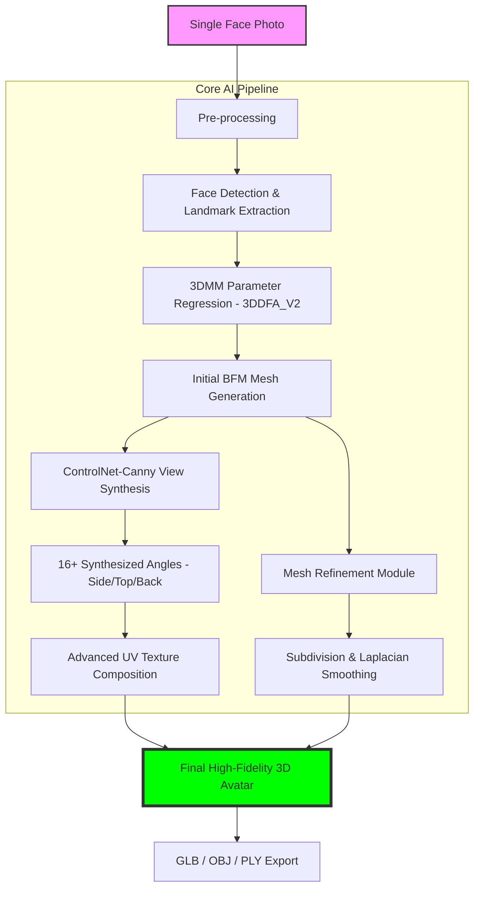
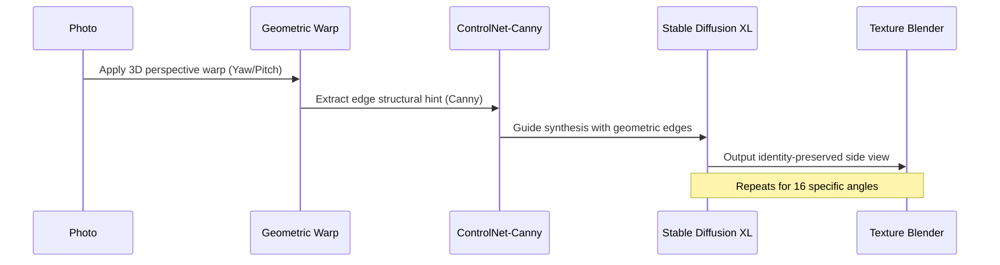

# 🇮🇳 Indian Avatar AI: Single Image to Stylized 3D (v2.0)

> **Research-grade pipeline for generating high-fidelity, stylized 3D avatars from a single face photo — optimized for Indian facial morphology, cultural aesthetics, and premium geometric smoothness.**

---

## 🌟 Overview

The **Indian Avatar AI (Perfection v2.0)** represents a state-of-the-art approach to 3D facial reconstruction. By combining **ControlNet-guided View Synthesis**, **BFM Morphable Models**, and **Advanced Mesh Refinement**, the system transforms a single 2D photograph into a high-resolution, animatable 3D model with seamless textures and professional-grade surface quality.

### 🚀 Perfection v2.0 Highlights
*   **Geometric Smoothing**: Laplacian filtering eliminates "faceted" artifacts for a premium, curved surface.
*   **High-Res Mesh**: Loop-style subdivision increases vertex density for localized refinement.
*   **Structural Fidelity**: ControlNet-Canny forces AI-synthesized side views to strictly obey the 3D head geometry.
*   **Seamless Textures**: Automated brightness normalization and cubic weighting ensure invisible transitions between views.

---

## 🏗️ Technical Pipeline & Workflows

### 1. High-Level System Architecture
The system follows a modular "Reconstruct-Synthesize-Refine" workflow:


```mermaid
graph TD
    %% Input Layer
    IN[Single Face Photo] --> PRE[Pre-processing]
    
    subgraph "Core AI Pipeline"
    PRE --> DET[Face Detection & Landmark Extraction]
    DET --> RECON[3DMM Parameter Regression - 3DDFA_V2]
    RECON --> BASE_MESH[Initial BFM Mesh Generation]
    
    %% Multi-View Synthesis
    BASE_MESH --> SYNTH[ControlNet-Canny View Synthesis]
    SYNTH --> VIEWS["16+ Synthesized Angles - Side/Top/Back"]
    
    %% Refinement Layer
    VIEWS --> TEX[Advanced UV Texture Composition]
    BASE_MESH --> MESH_REF[Mesh Refinement Module]
    MESH_REF --> SUBDIV[Subdivision & Laplacian Smoothing]
    end
    
    %% Export Layer
    TEX --> FINAL[Final High-Fidelity 3D Avatar]
    SUBDIV --> FINAL
    FINAL --> OUT[GLB / OBJ / PLY Export]

    style IN fill:#f9f,stroke:#333,stroke-width:2px
    style FINAL fill:#00ff00,stroke:#333,stroke-width:4px
```

### 2. Multi-View ML Workflow (ControlNet Detail)
Unlike standard generative models, our **Perfection v2.0** engine uses geometric structural hints to prevent identity drift at extreme angles.


```mermaid
sequenceDiagram
    participant P as Photo
    participant G as Geometric Warp
    participant C as ControlNet-Canny
    participant SD as Stable Diffusion XL
    participant T as Texture Blender

    P->>G: Apply 3D perspective warp (Yaw/Pitch)
    G->>C: Extract edge structural hint (Canny)
    C->>SD: Guide synthesis with geometric edges
    SD->>T: Output identity-preserved side view
    Note over SD,T: Repeats for 16 specific angles
```

---

## 📁 Repository Structure

```text
3d_model/
├── app.py                     # Main Gradio Interface (Slider-based UI)
├── src/
│   ├── models/
│   │   ├── face_recon.py      # 3DDFA_V2 + BFM integration logic
│   │   └── morphable_diffusion.py # Pipeline orchestrator
│   ├── synthesis/
│   │   └── multi_view_generator.py # ControlNet-Canny Synthesis Engine
│   ├── recon/
│   │   ├── mesh_refiner.py    # NEW: Subdivision & Laplacian Smoothing (v2.0)
│   │   ├── texture_composer.py # NEW: Brightness Norm & Cubic Blending (v2.0)
│   │   └── mesh_fit.py        # BFM parameter optimization
│   └── preprocess/
│       ├── extractor.py       # Landmark-based alignment
│       └── segment.py         # Multi-layer background removal
├── scripts/
│   ├── setup_venv.py          # Auto-environment setup
│   ├── train_lora.py          # Cultural LoRA training (indianface)
│   └── verify_final_lora.py   # Regression tests for AI weights
└── README.md
```

---

## 🔬 Core Algorithms

### 🌀 1. Geometry Perfection (MeshRefiner)
To achieve the "High Improvement" look, the `MeshRefiner` applies:
*   **Loop Subdivision**: Interstitial vertices are added to smooth out the silhoutte.
*   **Laplacian Filtering**: Computes the mean coordinates of neighboring vertices to reduce high-frequency geometric noise without losing volume.

### 🎨 2. Seamless Texture Blending
The `TextureComposer` solves the "ghosting" issue common in side-projection:
*   **3D Rotation Matrix**: Projecting vertices into `Ry @ Rx` space *before* sampling 2D pixels.
*   **Cubic Weighting**: `weight = confidence ** 3.0` ensures that only the most "front-facing" cameras contribute to a specific region, eliminating overlap blur.
*   **Luminance Normalization**: Every synthesized view's average brightness is matched to the original photo's histogram to prevent visible seams.

### 🤖 3. ControlNet View Synthesis
The engine generates 16 views (±30°, ±45°, ±60°, ±90°, Top, Bottom, Back):
*   **Conditioning**: Uses `lllyasviel/sd-controlnet-canny`.
*   **Sampling**: 20-step DPM++ Solver for crisp details.
*   **Prompting**: Dynamic prompts like `side view of a person, head turned, back of head view` combined with the `indianface` cultural LoRA.

---

## 🛠️ Tech Stack

*   **Logic**: Python 3.11 (optimized for `xformers` compatibility)
*   **DL Framework**: PyTorch 2.1 + CUDA 12.1
*   **Diffusion**: HuggingFace `diffusers` (SDXL / AnyLoRA)
*   **3D Ops**: `trimesh`, `scipy`, `onnxruntime-gpu`
*   **UI**: Gradio 5.x (Custom CSS & Slider-based previews)

---

## 🚀 Getting Started

### Installation
```powershell
python scripts/setup_venv.py
python app.py
```

### Usage
1.  **Upload**: Provide a clear front-facing photo.
2.  **Generate**: Click "Generate 3D Avatar".
3.  **Review**: Use the **Angle Slider** to inspect the 16 synthesized views.
4.  **Refine**: Modify the BFM Shape/Expression sliders for real-time mesh updates.
5.  **Export**: Download the `.glb` model for Metaverse integration.

---

## 📄 License & Credits
Developed by the **GUNI Research Intern Team**. For academic and research use only.
Based on **3DDFA_V2**, **BFM Core**, and **Stable Diffusion**.

---
*Generated by Antigravity AI for Perfection v2.0*
