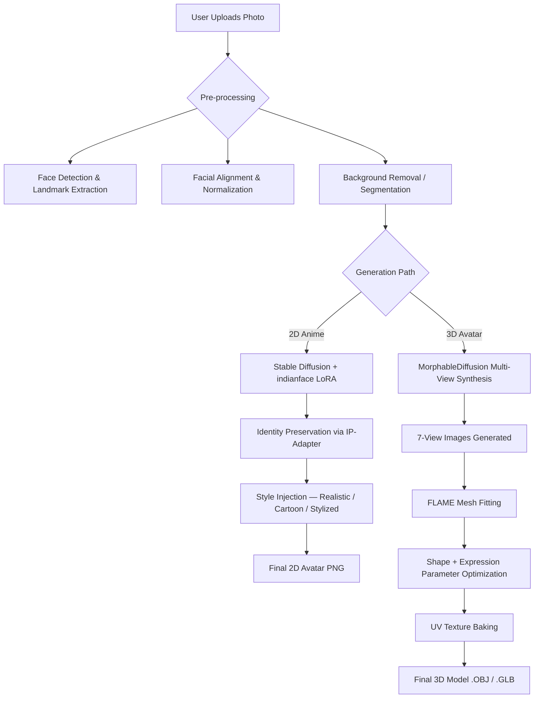

# 🇮🇳 Indian Avatar AI: Single Image to Stylized 3D

> **Research-grade pipeline for generating high-fidelity, stylized 2D & 3D avatars from a single face photo — built specifically for the Indian demographic.**

---

## 🌟 Introduction

The **Indian Avatar AI** solves the "representation gap" in global AI models by focusing on Indian facial morphology, diverse skin tones, and cultural aesthetics.

The system provides a seamless experience for:
*   **2D Anime Stylization** — High-fidelity artistic avatars with cultural trigger-word LoRA (`indianface`).
*   **3D Avatar Reconstruction** — Geometry-accurate, FLAME-based 3D head models ready for metaverse/gaming.
*   **Interactive Sliders** — Real-time control over FLAME shape/expression parameters.

---

## 🏗️ System Architecture & Workflow


```mermaid
graph TD
    A[User Uploads Photo] --> B{Pre-processing}
    B --> B1[Face Detection & Landmark Extraction]
    B --> B2[Facial Alignment & Normalization]
    B --> B3[Background Removal / Segmentation]

    B3 --> C{Generation Path}

    C -->|2D Anime| D[Stable Diffusion + indianface LoRA]
    D --> D1[Identity Preservation via IP-Adapter]
    D1 --> D2[Style Injection — Realistic / Cartoon / Stylized]
    D2 --> E[Final 2D Avatar PNG]

    C -->|3D Avatar| F[MorphableDiffusion Multi-View Synthesis]
    F --> F1[7-View Images Generated]
    F1 --> G[FLAME Mesh Fitting]
    G --> G1[Shape + Expression Parameter Optimization]
    G1 --> G2[UV Texture Baking]
    G2 --> H[Final 3D Model .OBJ / .GLB]
```

---

## 📁 Project Structure

```
3d_model/
├── app.py                     # Gradio UI — single entry point
├── requirements.txt           # Pip dependencies
├── constraints.txt            # Version constraints for compatibility
├── scripts/
│   ├── setup_venv.py          # Auto-installs all dependencies
│   ├── download_imfdb.py      # Downloads IMFDB dataset
│   ├── preprocess_imfdb.py    # MediaPipe face alignment & normalization
│   ├── train_lora.py          # LoRA fine-tuning with 8-bit optimizer
│   ├── prepare_lora_metadata.py # Builds dataset_info.json for training
│   ├── fix_dependencies.py    # Resolves Windows-specific package conflicts
│   ├── verify_final_lora.py   # Validates trained LoRA weights
│   ├── inspect_unet.py        # Inspects UNet architecture layers
│   └── test_gpu.py            # CUDA/GPU diagnostic tool
├── src/
│   ├── __init__.py
│   ├── models/
│   │   ├── anime_gen.py       # 2D anime generation pipeline
│   │   ├── face_recon.py      # Face reconstruction model wrapper
│   │   └── flame_wrapper.py   # FLAME parametric model interface
│   ├── recon/
│   │   ├── __init__.py
│   │   └── mesh_fit.py        # FLAME mesh fitting & optimization loop
│   └── preprocess/
│       └── ...                # Face detection, alignment utilities
├── data/
│   ├── raw/                   # Raw IMFDB images (git-ignored)
│   └── processed/             # Aligned training images (git-ignored)
└── assets/                    # UI assets (git-ignored)
```

---

## 🛠️ Tech Stack & Libraries

### Core Architecture
| Layer | Technology | Purpose |
| :--- | :--- | :--- |
| **Language** | Python 3.11 | Optimized for library compatibility |
| **AI Framework** | PyTorch 2.x + CUDA 12.1 | GPU-accelerated training & inference |
| **Distribution** | HuggingFace `diffusers`, `transformers`, `accelerate` | Model loading & pipelines |
| **Generative AI** | Stable Diffusion (AnyLoRA) | Base image synthesis engine |
| **Optimization** | PEFT (LoRA) | Cultural adaptation without full retraining |
| **Computer Vision** | MediaPipe | Real-time facial mesh & iris tracking |
| **3D Geometry** | FLAME Model | SOTA morphable face model |
| **UI** | Gradio 5.x | Reactive web interface with sliders |
| **Backend** | Uvicorn / FastAPI | Local serving |

---

## 🤖 Algorithms & Training

### 1. Fine-tuning with LoRA (Low-Rank Adaptation)
Instead of training from scratch, **LoRA** injects "Indian intelligence" into the base diffusion model:
*   **Trigger Word**: `indianface`
*   **Dataset**: 25,000+ pre-processed images from IMFDB
*   **Focus**: Correct skin tone rendering, traditional clothing (Sari/Kurta), jewelry (Nose pins/Jhumkas)
*   **Optimizer**: AdamW 8-bit for 4GB VRAM compatibility

### 2. FLAME Mesh Fitting Pipeline
Iterative optimization loop to fit the FLAME mesh to 2D landmarks:
1. **Landmark Projection** — Translate 2D MediaPipe points into 3D space.
2. **Loss Function** — Minimize vertex-to-landmark distance + perceptual loss.
3. **Regularization** — Ensure biological plausibility using FLAME's learned priors.
4. **UV Baking** — Project original image texture onto the final mesh.

### 3. Multi-View Synthesis
Uses **MorphableDiffusion** to generate 7 consistent views from a single input image before mesh reconstruction — dramatically improving geometric accuracy.

---

## 📊 Dataset: IMFDB (Indian Movie Face Database)

*   **Extraction**: `scripts/download_imfdb.py` interfaces with academic CDNs.
*   **Preprocessing**: `scripts/preprocess_imfdb.py` uses MediaPipe for square, normalized crops.
*   **Volume**: 34,000+ raw → 25,000+ clean training samples.

---

## ⚠️ Challenges & Solutions

| # | Problem | Solution |
| :--- | :--- | :--- |
| 🔴 **4GB VRAM limit** | Diffusion models OOM on low-VRAM GPUs | 8-bit quantization (`bitsandbytes`) + gradient checkpointing + safe-tensors |
| 🟡 **Windows xformers crash** | Broken binary compatibility on Python 3.11/3.12 | Refactored to PyTorch 2.0 **SDPA** (native, no extra package needed) |
| 🔵 **Dual-GPU confusion** | Intel iGPU causes PyTorch to pick the wrong device | Explicit `CUDA_VISIBLE_DEVICES=0` + device-aware model loading |
| 🟢 **LoRA metadata errors** | `dataset_info.json` format mismatch blocking training | `scripts/prepare_lora_metadata.py` auto-generates correct metadata |

---

## 🖥️ Hardware Requirements

| Component | Minimum | Recommended |
| :--- | :--- | :--- |
| **GPU** | NVIDIA 4GB VRAM (e.g. RTX 3050) | NVIDIA 8GB+ VRAM |
| **RAM** | 8 GB | 16 GB |
| **Storage** | 20 GB | 50 GB (for datasets + models) |
| **CUDA** | 11.8 | 12.1 |

**Memory optimizations used:**
*   `enable_sequential_cpu_offload()` — reduces VRAM from ~8GB to ~3.2GB
*   `enable_vae_tiling()` — allows high-res generation on limited memory

---

## 🚀 Quick Start

```bash
# 1. Clone the repository
git clone https://github.com/Dhruvil1308/Single-Image-to-Stylized-3D.git
cd Single-Image-to-Stylized-3D

# 2. Set up the virtual environment & install all dependencies
python scripts/setup_venv.py

# 3. Fix any Windows-specific dependency conflicts
python scripts/fix_dependencies.py

# 4. Download and preprocess the IMFDB dataset
python scripts/download_imfdb.py
python scripts/preprocess_imfdb.py

# 5. (Optional) Train your own LoRA
python scripts/prepare_lora_metadata.py
python scripts/train_lora.py

# 6. Verify LoRA weights (if trained)
python scripts/verify_final_lora.py

# 7. Launch the Gradio UI
python app.py
```

Then open [http://localhost:7860](http://localhost:7860) in your browser.

---

## 🧪 GPU Diagnostics

```bash
python scripts/test_gpu.py       # Check CUDA availability & VRAM
python scripts/inspect_unet.py   # Inspect UNet architecture
```

---

## 📦 Installation Notes

*   Python **3.11** is required (3.12 has xformers incompatibility).
*   `constraints.txt` pins exact versions to prevent dependency drift.
*   `third_party/` dependencies are cloned by `setup_venv.py` — not tracked in git.

---

## 📄 License

This project is for academic and research purposes. IMFDB dataset usage is subject to its own academic license.

---

*Developed by the **GUNI Research Intern Team***
